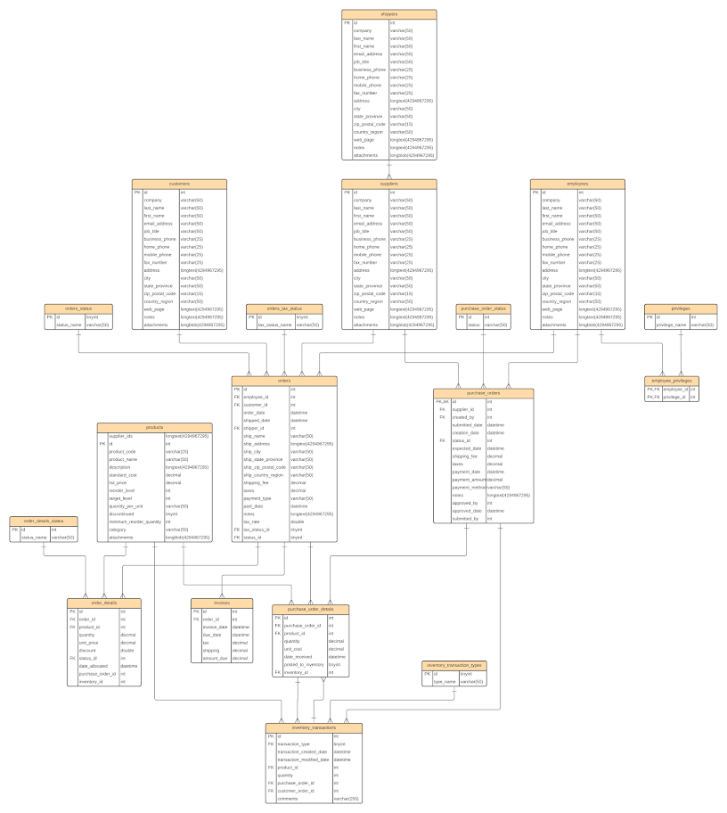

# DW_lab_6730202647

---
## **โครงสร้างมาตรฐาน (Project Structure) ที่ dbt สร้างขึ้น**

เป็นระบบตามแนวทางของ Analytics Engineering โดยแต่ละโฟลเดอร์มีหน้าที่แตกต่างกันดังนี้:

    1. seeds/ (ตารางข้อมูลอ้างอิง)
ใช้สำหรับเก็บไฟล์ข้อมูลขนาดเล็กเช่นตารางอ้างอิง ตารางรหัสสินค้า (ที่เป็นไฟล์ .csv) เพื่อให้ dbt นำไปสร้างเป็นตารางในฐานข้อมูลโดยอัตโนมัติ

เหมาะสำหรับ: ข้อมูลที่ไม่ได้อยู่ในระบบฐานข้อมูลหลัก แต่จำเป็นต้องนำมาใช้ JOIN หรืออ้างอิง เช่น ตารางรายชื่อประเทศ, รหัสไปรษณีย์, หรือคำอธิบายสถานะออเดอร์

วิธีใช้: นำไฟล์ CSV ไปวาง แล้วรันคำสั่ง dbt seed ข้อมูลจะถูกอัปโหลดเข้าฐานข้อมูลทันที

    2. macros/ (โค้ดที่ใช้ซ้ำได้)    
คือโฟลเดอร์ที่เก็บ "ฟังก์ชัน" หรือชุดคำสั่ง SQL ที่เขียนขึ้นเองเพื่อใช้ซ้ำได้ทั้งโปรเจกต์

สมมุติต้องคำนวณภาษีมูลค่าเพิ่ม (VAT 7%) จากยอดขายบ่อยๆ แทนที่จะเขียน amount * 0.07 ทุกที่ ให้สร้างไฟล์ในโฟลเดอร์ macros/
```sql
-- ไฟล์: macros/calculate_tax.sql

    ({{ amount_column }} * {{ tax_rate }})

```

เมื่อสร้าง Macro เสร็จแล้ว คุณสามารถเรียกใช้ภายในโมเดล SQL ของคุณได้ง่ายๆ โดยใช้ไวยากรณ์ {{ ชื่อ_macro(...) }} ดังนี้:
```sql
-- ไฟล์: models/stg_orders.sql
with orders as (
    select * from {{ source('northwind', 'orders') }}
)

select
    order_id,
    order_amount,
    -- เรียกใช้ Macro มาคำนวณภาษี
    {{ calculate_tax('order_amount') }} as tax_amount,
   
    -- เรียกใช้ Macro โดยระบุอัตราภาษีพิเศษ (เช่น 10%)
    {{ calculate_tax('order_amount', tax_rate=0.10) }} as tax_amount_high_rate
from orders
```


หน้าที่: เหมือนกับการเขียนฟังก์ชันในภาษา Programming ปกติ เช่น เขียน Macro สำหรับการคำนวณภาษีหรือการทำ Data Masking แล้วเรียกใช้ผ่าน {{ calculate_tax(amount) }} ใน SQL โมเดล แทนที่จะต้องเขียนโค้ดซ้ำๆ ทุกครั้ง

ประโยชน์: ช่วยให้โค้ดสะอาด ลดการเขียนซ้ำ (DRY - Don't Repeat Yourself) และง่ายต่อการแก้ไข

    3. analyses/ (พื้นที่ทดลองเขียน SQL)
ใช้สำหรับเก็บไฟล์ SQL ที่ไม่ได้ต้องการให้ dbt สร้างเป็นตารางหรือวิวในฐานข้อมูล

หน้าที่: สำหรับเก็บ Query วิเคราะห์ข้อมูลแบบเฉพาะกิจ (Ad-hoc queries) หรือ Query ที่ใช้เพื่อตรวจสอบข้อมูลก่อนนำไปสร้างโมเดลจริง ไฟล์ในนี้จะถูกเก็บไว้เป็นส่วนหนึ่งของโปรเจกต์แต่จะไม่มีการรันเพื่อสร้าง Table จริงๆ

    4. snapshots/ (การทำบันทึกประวัติข้อมูล - SCD Type 2)
โฟลเดอร์นี้สำคัญมากสำหรับการติดตามการเปลี่ยนแปลงข้อมูล (Slowly Changing Dimensions - SCD)

หน้าที่: ใช้สำหรับ "Snapshot" ข้อมูลที่เปลี่ยนสถานะได้ตลอดเวลา เช่น หากต้องการรู้ว่า "สถานะออเดอร์ของลูกค้าเปลี่ยนไปอย่างไรตามกาลเวลา" dbt จะบันทึกค่าเดิมเก็บไว้และสร้างแถวใหม่เมื่อมีการเปลี่ยนแปลง ทำให้สามารถติดตามประวัติการเปลี่ยนแปลงของข้อมูลในอดีตได้

    5. tests/ (พื้นที่เก็บเงื่อนไขการทดสอบข้อมูลแบบซับซ้อน)
ใช้สำหรับเก็บคำสั่งตรวจสอบคุณภาพข้อมูล (Data Quality Tests) ที่ซับซ้อนเกินกว่ากฎพื้นฐาน (Generic Tests) ในไฟล์ schema.yml จะทำได้

หน้าที่: เขียน SQL Query เพื่อตรวจสอบเงื่อนไขทางธุรกิจที่คุณต้องการ เช่น "ห้ามมียอดออเดอร์ติดลบ" หรือ "วันที่จัดส่งต้องไม่มาก่อนวันที่สั่งซื้อ" โดยเขียนเป็นไฟล์ .sql หากคิวรีเหล่านี้ได้ผลลัพธ์ (row) ออกมาแม้แต่แถวเดียว dbt จะถือว่า Test นั้น Fail ครับ

**สรุปความสัมพันธ์**

models/: คือสายการผลิตหลัก (สร้าง Table/View)

seeds/: คือคลังวัตถุดิบเสริม (CSV อ้างอิง)

macros/: คือเครื่องมือช่วยผลิต (ฟังก์ชันซ้ำๆ)

snapshots/: คือบันทึกประวัติการเปลี่ยนแปลง

tests/: คือฝ่ายตรวจสอบคุณภาพสินค้า (QC)

---
## Introducing OLAP for Northwind OLTP Database
**What's the current setup or architecture?**

- Northwind traders are companies that buy and sell special foods worldwide.
- This is a practice database made by Microsoft to showcase its product features and for learning purposes.
- The current setup combines on-site and older systems.
- They use MySQL for their main daily sales transactions.
- MySQL is also used for creating and running reports, but it's not efficient because analytical queries slow down the transaction system.

### Identifying Business Requirements
Throughout the interview process with the business and stakeholders, the following business processses were identified:
- **Sales Overview:**
Overall sales reports to understand better, what is being sold to our customers, what sells the most, where and what sells the least, the goal is to have a general overview of how the business is going.

This means the business is looking forward to getting insights on sales overview.

### Identifying required tables from ERD

From the above ERD diagram of the OLTP transactional system, we identify the following required tables that will enable us to meet the business requirements:

<br>
<li>Customers - Customers who buy items from Northwind</li>
<li>Employees - Those who work for Northwind</li>
<li>Orders - Sales Order transactions taking place between the customers & Northwind</li>
<li>Order Details - Order Details for the Orders placed by customer</li>
<li>Inventory Transaction - Transaction details of each inventory</li>
<li>Products - Current Northwind products that customers can purchase</li>
<li>Shippers - Shipped orders from Northwind to customers</li>
<li>Suppliers - Supplies Northwind with required items</li>
<li>Invoices - Invoice created for each order</li>

### **Staging Layer**
In the staging layer, we have the following tables:
- customers: load customers from datasets/customer.csv and insert ingestion timestamp.
- employees: load employees from datasets/employees.csv and insert ingestion timestamp.
- orders: load orders from datasets/orders.csv and insert ingestion timestamp.
- order_details: load order_details from datasets/order_details.csv and insert ingestion timestamp.
- inventory_transactions: load inventory_transactions from datasets/inventory_transactions.csv and insert ingestion timestamp.
- products: load products from datasets/products.csv and filter out rows where supplier_ids contains multiple semicolon-delimited values and insert ingestion timestamp.
- shippers: load shippers from datasets/shippers.csv and insert ingestion timestamp.
- suppliers: load suppliers from datasets/suppliers.csv and insert ingestion timestamp.
- invoices: load invoices from datasets/invoices.csv and insert ingestion timestamp.
